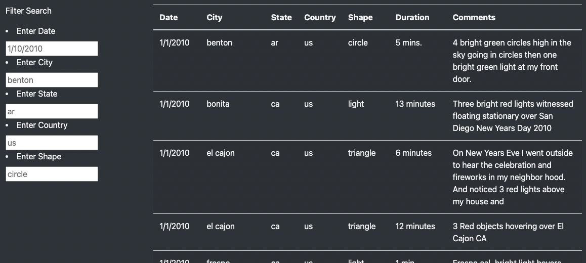
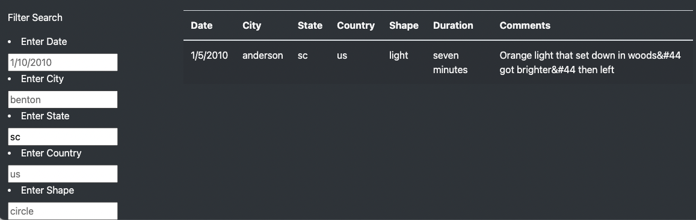
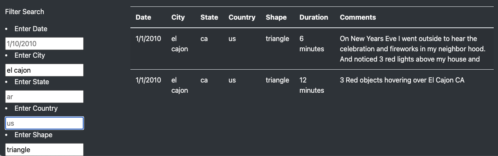

# UFOs

## Project Overview
This project displays a large amount of UFO sighting data and allows users to filter for multiple sighting criteria, including: date, city, state, country, and shape. The visualization is built with HTML with bootstrap styling and runs a JavaScript code to display the results in a table and powers the filters.

## Results
### Landing on the Page
Once landing on the UFO Sightings Page, users will see a navigation bar, jumbotron header, article title, and paragraph.

### Initial data results
Below the welcome page is the full data set. 

### Customized search filters
If a user wants to drill down to specific sightings, for example, searching my home state of SC, they can use the filters to the left of the table.

It is possible to search for multiple criteria. In this example, the search is done by city and by shape.

## Summary 
The one major drawback of this design is the the search criteria inputs must be exact matches to the data set, which is all lowercase, and has no extra spaces. For example, inputting "SC" in the state filter will not generate any results. The user has to input "sc," which is not very intuitive.  

Reccomendations for Further Development: 
- Consider replacing free form fills with drop-down menus to reduce user input / mismatches. 
- This could be taken a step forward with dynamic filters. If a user first selects a state, the "city" criteria could logically supply the city options for that state. Then users don't have to guess, have correct capitalization, spacing, etc. 
- Free field options could be expanded to be more forgiving for case sensitivity, extra spaces, etc.
- The date filter could be updated with a date picker that allows searching by year, month, and day would provide more options. 
